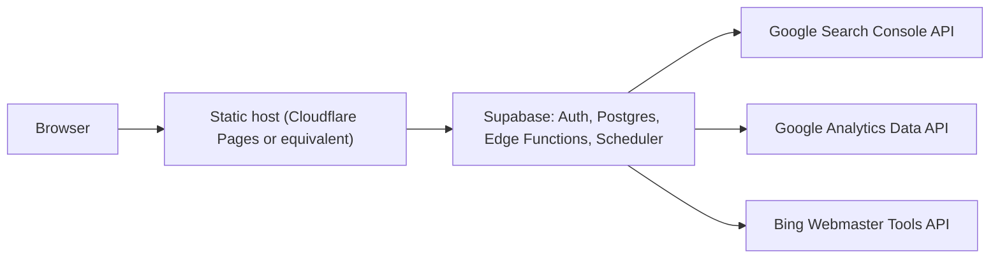
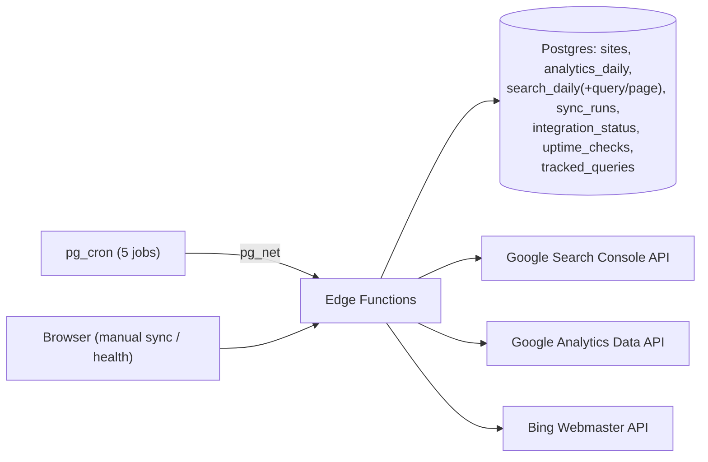

# Site Analytics

[](https://github.com/jafforgehq/site-analytics-tool/actions/workflows/ci.yml)

Self-hosted dashboard for monitoring Google Analytics 4, Google Search Console, and Bing Webmaster Tools across multiple websites.

It gives a solo publisher or small portfolio operator one private place to see traffic, search performance, data coverage, integration health, sync history, and the sites that need attention.

> **Single-admin by design.** This is a self-hosted control center, not a multi-tenant SaaS. It has no public signup, billing, organization workspaces, or role-management UI.

> **Recommended free stack:** deploy the frontend on [Cloudflare Pages](https://pages.cloudflare.com/) and use [Supabase's Free plan](https://supabase.com/pricing) for Auth, Postgres, Edge Functions, and scheduled jobs. This guide uses that combination from start to finish. You can deploy the static frontend to another host if you prefer.

## Live demo

[Open the hosted demo portal](https://admin-a0k.pages.dev/) and choose **View public demo**, or go directly to the [public demo dashboard](https://admin-a0k.pages.dev/demo). It uses only hardcoded synthetic data and never reads from a Supabase project.

## What it does

- Portfolio view with traffic and search KPIs, top movers, anomaly signals, and coverage gaps.
- Per-site GA4, Google Search Console, and Bing performance charts.
- Google Search Console top-query and top-page reporting.
- Daily scheduled syncs plus manual per-site syncs.
- Sync history, stale-data detection, sanitized errors, and data-retention controls.
- Email/password sign-in with mandatory TOTP MFA before dashboard data can be read.
- Supabase Row Level Security: browser reads require both an allowlisted admin and an MFA-verified (`aal2`) session.
- CSV/ZIP and PDF exports, plus a privacy mode for screensharing.
- One-click full-portfolio export (JSON) for feeding into an AI agent: every table plus derived insights and forecasts in one file.
- Light, dark, and system theme with a per-device preference.
- Traffic trajectory forecasting (Holt-Winters with weekly seasonality, computed locally) with confidence bands on charts, for every metric and the whole portfolio combined.
- Content refresh queue: pages whose Google clicks decayed ≥25% versus their own prior 28 days, ranked by lost volume.
- Lightweight query rank tracking: star Search Console queries and chart their average position over time - no scraping, no extra API calls.
- Hourly uptime checks of each site's public URL with a 7-day availability view.
- AI briefing (coming soon): the backend is built and safe to deploy today, but not yet wired into the UI.

## Product tour

The screenshots below use the built-in privacy mode, which masks site names, domains, account details, and timestamps. The report examples show the generated PDF export.

### Portfolio overview and managed sites

<p align="center">
  
  
</p>

### Sync history and system health

<p align="center">
  
  
</p>

### PDF performance report

<p align="center">
  
  
</p>

<p align="center">
  
</p>

## Architecture



## Before you start: what you need

| Item | Why it is needed | Where it goes | Never commit it? |
| --- | --- | --- | --- |
| Supabase project URL and publishable key | Browser connects to your own Supabase project | `.env.local` and host environment variables | Publishable key is browser-safe; project URL is public |
| Supabase CLI (step 5 only) | The single step not done in a browser: deploying the Edge Functions | Your shell/CLI only | Yes |
| Google Cloud OAuth client ID and secret | Server-to-server access to GSC and GA4 | Supabase Edge Function secrets | Yes |
| Google OAuth refresh token | Lets scheduled jobs obtain short-lived Google access tokens | Supabase Edge Function secrets | Yes |
| Bing Webmaster API key | Fetches Bing traffic metrics | Supabase Edge Function secrets | Yes |
| Random automation secret | Authenticates Supabase scheduled calls to Edge Functions | Edge Function secrets **and** Supabase Vault | Yes |
| Public app URL | Auth redirects, CORS, and password-reset links | `VITE_APP_URL`, `ALLOWED_APP_ORIGIN`, Supabase Auth URLs | No credential, but use your real URL |

### Provider access required

1. **Google Search Console:** the Google account used for OAuth must have access to every Search Console property you add.
2. **Google Analytics 4:** that same Google account needs at least Viewer access to each GA4 property.
3. **Bing Webmaster Tools:** your API key must have access to every Bing site URL you add.

Google uses OAuth credentials here-not a Google API key. Enable the **Google Search Console API** and **Google Analytics Data API** in the same Google Cloud project before authorizing the app.

## Local quick start (synthetic data only)

This path does **not** touch a hosted Supabase project, your live sites, Google, or Bing.

### Prerequisites

- Node.js 20+ and npm
- Docker Desktop
- [Supabase CLI](https://supabase.com/docs/guides/local-development/cli/getting-started)

```bash
git clone https://github.com/jafforgehq/site-analytics-tool.git
cd site-analytics-tool
npm install
supabase start
supabase db reset
```

Copy the local API URL and **publishable** key from `supabase status`, then create `.env.local`:

```bash
cp .env.example .env.local
```

```dotenv
VITE_SUPABASE_URL=http://127.0.0.1:54321
VITE_SUPABASE_PUBLISHABLE_KEY=your-local-publishable-key
VITE_APP_URL=http://localhost:5173
```

Start the frontend:

```bash
npm run dev
```

The seed contains synthetic sites and metrics. To see them, create a user in local Supabase Studio, then run this in Studio's SQL editor with that user's UUID:

```sql
insert into private.admin_users (user_id)
values ('YOUR_AUTH_USER_UUID');
```

Sign in at `http://localhost:5173` and complete the TOTP setup. An `aal2` session is required before data becomes visible.

## Production setup

The following is a Cloudflare Pages + Supabase operator checklist. Replace every placeholder with your own values as you go. Nothing in this repository deploys automatically.

### Cost and accounts

For a small, personal portfolio this can run at $0 on the providers' Free plans:

- **Supabase Free:** includes a 500 MB database and two active projects. Free projects pause after one week of inactivity, so the first request after a long idle period can take a moment to wake it.
- **Cloudflare Pages Free:** serves this static frontend and provides 500 builds per month. Static asset requests are free and unlimited.

You need free accounts with **Supabase**, **Cloudflare**, **GitHub** (to connect this repository to Cloudflare Pages), Google Cloud, and Bing Webmaster Tools. Provider limits and pricing can change, so check their current plan pages before relying on this for a larger portfolio.

> **Set everything up from the web - no terminal.** Every step below is done in a browser: the Supabase Dashboard, the Google Cloud Console, the Google OAuth Playground, Bing Webmaster Tools, and your static host. There is exactly **one** exception - deploying the five Edge Functions (step 5) - because they share code under `_shared/` that no dashboard editor can bundle. That single step runs a few one-time commands; everything else is point-and-click.

> **Choose your Cloudflare Pages project name first.** Its default public URL will be `https://YOUR_PROJECT_NAME.pages.dev`. Use that exact URL wherever this guide shows `https://monitor.example.com`. You can use a custom domain later, but then update `ALLOWED_APP_ORIGIN`, Supabase Auth URLs, and `VITE_APP_URL` to the custom domain too.

### 1. Create the project and apply migrations

Create a new Supabase project in the dashboard. In **Project Settings → API**, note the project URL and publishable key.

Then apply the database migrations. They create the tables, RLS policies, Edge Functions' database permissions, scheduled cron jobs, and retention jobs.

Open the **SQL Editor**, then open each file in [`supabase/migrations/`](supabase/migrations) on GitHub in filename order (`0001` → `0011`), paste its contents into a new query, and run it - one file at a time, in order.

Afterwards, open **Integrations → Cron → Jobs**: five jobs (three daily syncs, an hourly uptime check, and a weekly cleanup) should be listed. Scheduled syncs will report configuration errors until the secrets in the next steps exist; they do not affect an unrelated project.

### 2. Configure Google Cloud and mint a refresh token

This produces three of your Edge Function secrets: `GOOGLE_CLIENT_ID`, `GOOGLE_CLIENT_SECRET` (from the OAuth client in the [Google Cloud Console](https://console.cloud.google.com)), and `GOOGLE_REFRESH_TOKEN` (minted by the repo's own `npm run oauth:google` helper, [`scripts/google-oauth.ts`](scripts/google-oauth.ts)).

1. **Create or select a project.** One project holds both APIs and the OAuth client.
2. **Enable the two APIs.** In **APIs & Services → Library**, enable **Google Search Console API** and **Google Analytics Data API**. You can confirm both afterwards under **APIs & Services → Enabled APIs & services**, which also shows each API's request, error, and latency metrics.
3. **Configure the OAuth consent screen** (**APIs & Services → OAuth consent screen**, surfaced under "Google Auth Platform" in the newer console). The app requests only two **read-only** scopes - `.../auth/webmasters.readonly` (Search Console) and `.../auth/analytics.readonly` (GA4). While the app is in **Testing**, add the Google account that owns the sites as a **test user**, or authorization is blocked - and see the note at the end of this section about what Testing mode means for how often you'll be back here.
4. **Create the OAuth client.** In **APIs & Services → Credentials → Create credentials → OAuth client ID**, pick application type **Web application** (not Desktop/iOS/Android - this flow authenticates with a client secret, which those types don't use the same way) and name it anything (e.g. `Site Analytics`). Copy its **Client ID** and **Client secret** - these are `GOOGLE_CLIENT_ID` and `GOOGLE_CLIENT_SECRET`.
5. **Add the helper script's redirect URI.** On the OAuth client you just created, add `http://localhost:5179/oauth2callback` to its **Authorized redirect URIs** and save (Google requires an exact match, port included). This is the local helper's own callback address - it's separate from, and doesn't replace, an OAuth Playground redirect URI if you also add one for manual/fallback use.

Now mint the refresh token with the repo's own helper - no browser-based Playground fiddling needed:

```
GOOGLE_CLIENT_ID=your-client-id GOOGLE_CLIENT_SECRET=your-client-secret npm run oauth:google
```

It prints an authorization URL - open it, sign in with the Google account that can read all intended Search Console and GA4 properties, and approve access (accept the "unverified app" notice if your consent screen is still in Testing). The script then prints the refresh token once in the terminal; that value is `GOOGLE_REFRESH_TOKEN`. Store it immediately in a password manager or directly as the Supabase Edge Function secret; never paste it into source code, an issue, or a commit.

If it fails instead, the script's own error output tells you which of two things went wrong - `unauthorized_client`/`redirect_uri_mismatch` means step 5 above wasn't done (or doesn't match exactly); `invalid_client` means the client ID/secret pair is stale (re-copy both from Credentials). If Google never returns a refresh token at all, remove the app under your Google Account's **Third-party access**, then re-run so Google issues a fresh one (the script already requests `prompt=consent` for this reason).

*(Prefer the browser instead? The [Google OAuth 2.0 Playground](https://developers.google.com/oauthplayground) works the same way: gear icon → your own OAuth credentials → paste both scopes into "Input your own scopes" → Authorize → Exchange authorization code for tokens. It needs its own redirect URI, `https://developers.google.com/oauthplayground`, added to the same OAuth client - only useful as a fallback, since it needs the extra manual steps above and doesn't print the same clear error diagnosis this repo's helper does.)*

**Renewing a dead refresh token later:** if GA4/GSC syncs start failing in production with `auth_error` and Sync History shows `invalid_grant - Token has been expired or revoked.`, the refresh token itself has died - either it was revoked, or (very commonly, while the consent screen is still in **Testing**) it hit Google's 7-day auto-expiry for test-user tokens. Fix: re-run the exact command above and paste the new token into `GOOGLE_REFRESH_TOKEN` - nothing else needs to change, since `GOOGLE_CLIENT_ID`/`GOOGLE_CLIENT_SECRET` and the redirect URI registration are unaffected by this. To stop it recurring, publish or verify the OAuth consent screen (**APIs & Services → OAuth consent screen → Publish app**) so tokens stop expiring on that 7-day cycle.

### 3. Create a Bing API key

In Bing Webmaster Tools, create an API key from an account that can access each site you plan to add. Copy it into the `BING_WEBMASTER_API_KEY` Edge Function secret in step 4.

### 4. Set Edge Function secrets and Vault values

Generate a long random value for `AUTOMATION_SECRET`. You will reuse the **exact same value** for the `automation_secret` Vault entry below - the scheduled jobs authenticate with it, so a mismatch makes every scheduled sync fail with a 401.

**Edge Function secrets** (the server credentials) - go to **Edge Functions → Secrets**. The "Add or replace secrets" box accepts pasted key–value pairs, so you can add all six at once:

```
GOOGLE_CLIENT_ID=YOUR_GOOGLE_CLIENT_ID
GOOGLE_CLIENT_SECRET=YOUR_GOOGLE_CLIENT_SECRET
GOOGLE_REFRESH_TOKEN=YOUR_GOOGLE_REFRESH_TOKEN
BING_WEBMASTER_API_KEY=YOUR_BING_WEBMASTER_API_KEY
AUTOMATION_SECRET=YOUR_LONG_RANDOM_VALUE
ALLOWED_APP_ORIGIN=https://monitor.example.com
```

**Vault values** (what the scheduled cron jobs read at run time) - go to **Integrations → Vault → Secrets** and choose **Add new secret** twice:

- Name `project_url`, value `https://YOUR_PROJECT_REF.supabase.co`
- Name `automation_secret`, value the same random string you used for `AUTOMATION_SECRET` above

### 5. Deploy the Edge Functions - the one terminal step

This is the **only** part that isn't point-and-click. The eight functions - `manage-sites`, `manage-portfolio`, `manual-sync`, `scheduled-sync-gsc`, `scheduled-sync-ga4`, `scheduled-sync-bing`, `scheduled-uptime`, `ai-briefing` - share helpers in [`supabase/functions/_shared/`](supabase/functions/_shared) (imported as `../_shared/...`), and the dashboard's in-browser editor deploys one function in isolation, so it can't resolve those shared imports. The [Supabase CLI](https://supabase.com/docs/guides/local-development/cli/getting-started) bundles the shared code automatically, so run this once from a clone of the repo:

```bash
supabase login
supabase link --project-ref YOUR_PROJECT_REF
supabase functions deploy manage-sites
supabase functions deploy manage-portfolio
supabase functions deploy manual-sync
supabase functions deploy scheduled-sync-gsc
supabase functions deploy scheduled-sync-ga4
supabase functions deploy scheduled-sync-bing
supabase functions deploy scheduled-uptime
supabase functions deploy ai-briefing
supabase functions deploy site-audit-crawl
supabase functions deploy common-crawl-sync
```

Then confirm all ten appear under **Edge Functions** in the dashboard. After this one step, everything else is back in the browser.

### 6. Lock down Supabase Auth and create your admin

In **Authentication → Sign In / Providers**, keep email enabled and disable public sign-up. In **Authentication → URL Configuration**, set:

- Site URL: `https://monitor.example.com`
- Redirect URLs: `https://monitor.example.com/reset-password` and your local development URL if needed.

Create your first user in the Supabase Dashboard (Authentication → Users). Copy the UUID and add it to the private allowlist:

```sql
insert into private.admin_users (user_id)
values ('YOUR_AUTH_USER_UUID');
```

Once the app is deployed (step 7), that user signs in and enrolls TOTP in the app. A password alone is intentionally insufficient.

### 7. Deploy the static frontend

This project is a static Vite frontend. The recommended $0 deployment path is **Cloudflare Pages**:

1. Push your own copy (fork or cloned repository) to GitHub. Do not add `.env.local` or any provider secret to Git.
2. In Cloudflare, open **Workers & Pages** → **Create application** → **Pages** → **Connect to Git**. Authorize GitHub, select your repository, and choose the project name you picked above.
3. In the build configuration, leave the root directory blank, select the `main` branch, and enter the build settings below.
4. Before the first production deployment, open **Settings** → **Variables and secrets**. Add the three required `VITE_*` variables for the **Production** environment. Use the Plaintext type: these are public browser configuration values, not server secrets.
5. Click **Save and Deploy**. Cloudflare builds the site and gives you `https://YOUR_PROJECT_NAME.pages.dev`.
6. Visit that URL, sign in with the admin account from step 6, and complete the TOTP enrollment. Run one manual sync and check **Sync history** before trusting scheduled data.

Use these Cloudflare build settings:

| Setting | Value |
| --- | --- |
| Build command | `npm run build` |
| Output directory | `dist` |
| Node version | 20 or newer |
| `VITE_SUPABASE_URL` | Your project URL |
| `VITE_SUPABASE_PUBLISHABLE_KEY` | Your project's publishable key |
| `VITE_APP_URL` | Your exact public application URL |
| `VITE_DB_SIZE_LIMIT_MB` | Optional: plan database limit in MB |

`VITE_SUPABASE_URL`, `VITE_SUPABASE_PUBLISHABLE_KEY`, and `VITE_APP_URL` are required. `VITE_DB_SIZE_LIMIT_MB` is optional; on Supabase Free the default of 500 is already correct, so you can leave it out. Use the exact names - the app reads them at build time (via [`src/lib/env.ts`](src/lib/env.ts)) and will not start if they differ. The `VITE_` prefix is required for Vite to expose these values to the browser.

If you prefer Vercel, Netlify, GitHub Pages, or another static host, use the same build command, `dist` output directory, and `VITE_*` values. Configure SPA fallback to `index.html`; this repository includes [`public/_redirects`](public/_redirects) for hosts that support that convention. In all cases, the host URL must match `ALLOWED_APP_ORIGIN`, Supabase Auth's Site URL and Redirect URLs, and `VITE_APP_URL`.

If you use a custom domain on Cloudflare, add it under the Pages project's **Custom domains** settings. Then replace the default `pages.dev` URL in `ALLOWED_APP_ORIGIN`, Supabase Auth, and `VITE_APP_URL`. Change only the DNS record for that subdomain - do not change unrelated root-domain records.

### 8. Add your sites

From the **Sites** page, add each website and enter only the identifiers you use:

- **GSC property:** `sc-domain:example.com` for a Domain property, or the full URL for a URL-prefix property.
- **GA4 property ID:** numeric property ID, not the `G-XXXX` measurement ID.
- **Bing site URL:** the exact verified Bing site URL.

Configured integrations enable automatically. Use a manual sync for the first import, then inspect **Sync history** and **Integration health** before trusting scheduled data.

### About the `ai-briefing` Edge Function

The deploy list in step 5 includes an `ai-briefing` function: an analyst-style portfolio narrative generated via the Claude API. Its backend is complete and safe to deploy - it does nothing unless you add an `ANTHROPIC_API_KEY` Edge Function secret, size-caps its input, and never runs on a schedule - but the dashboard doesn't call it yet, so setting the secret has no visible effect today. Track its UI launch in [CHANGELOG.md](CHANGELOG.md).

## Two-factor authentication

TOTP two-factor auth is **mandatory**: browser reads require an MFA-verified (`aal2`) session, enforced in the database by Row Level Security. A valid password alone yields an empty dashboard. It is fully Supabase-native - Supabase generates the secret and QR code server-side, and no external 2FA service (SMS gateway, Authy, etc.) is involved. Any standard TOTP app works (Google Authenticator, Authy, 1Password, and so on).

**First-time setup.** After you add yourself to the admin allowlist (step 6), sign in with your password and the app immediately walks you through enrolling an authenticator: scan the QR code, enter the 6-digit code, and your session becomes `aal2`.

**Adding, replacing, or recovering a device.** By design, the in-app "add / remove authenticator" buttons do **not** work - a hardening trigger ([`0003_mfa_enrollment_guard.sql`](supabase/migrations/0003_mfa_enrollment_guard.sql)) blocks any MFA-factor change made from an app session, so that someone holding only your password cannot enroll their own factor and walk in. To move to a new phone, put your code on a second device, or recover a lost one, reset your factor from the Supabase **SQL editor** (the `postgres` role is exempt from the trigger) and then re-enroll:

```sql
-- Removes your current authenticator. Replace the email with your admin account.
delete from auth.mfa_factors
where user_id = (select id from auth.users
                 where email = 'you@example.com');
```

Then sign out, sign back in, and the app shows a fresh QR. Because TOTP secrets are not device-bound, scan that one QR on **every** device you want codes on **before** you verify - you cannot add more afterwards without repeating this reset. Note that you have no second factor between the delete and the re-enroll, so do it only when you can finish immediately; your password still gates sign-in during that short window.

## Safety model

- No server credential is bundled into the frontend.
- Browser-readable data requires an allowlisted admin and MFA at assurance level `aal2`.
- All provider writes use Supabase Edge Functions with server-side credentials.
- Errors are sanitized before storage and display.
- The v2 tables (tracked queries, uptime checks) follow the same model: browser reads require admin + `aal2`; all writes go through the `manage-portfolio` Edge Function with server-side caps on row counts and input sizes.
- The uptime prober only fetches `http(s)` URLs already stored in the admin-managed sites table, with a 10 s timeout, bounded concurrency, and 90-day self-pruning retention.
- The AI briefing endpoint requires admin + `aal2`, refuses when no `ANTHROPIC_API_KEY` secret is set, size-caps its input, and sanitizes provider errors so credentials can never leak.
- Local seed data is synthetic. `supabase db reset` resets only the local Docker database unless you deliberately target a hosted project with other CLI commands.

## Ninja Analytics Operations

This section is the operator reference for running this deployment day to day: where the data lives, what runs on a schedule, which secrets it needs, and how to check on it without hand-writing SQL each time.

### Architecture



### Tables

| Table | What it holds |
| --- | --- |
| `public.sites` | One row per tracked site: domain, `website_url`, and each provider's identifier (`gsc_property`, `ga4_property_id`, `bing_site_url`). |
| `public.analytics_daily` | GA4 daily aggregate (`active_users`, `sessions`, `screen_page_views`, ...), one row per `(site_id, metric_date)`. |
| `public.search_daily` | Google **and** Bing daily aggregate (`engine` = `google`/`bing`), one row per `(site_id, engine, metric_date)`. |
| `public.search_query_daily` / `public.search_page_daily` | Top Search Console queries/pages per day, also `engine`-aware. |
| `public.sync_runs` | Append-only attempt log - one row per sync attempt. Real timestamp columns are `started_at`/`finished_at` (there is no `created_at`). `source` is `gsc`/`ga4`/`bing` only - uptime is not a sync-run source. |
| `public.integration_status` | Current state, one row per `(site_id, source)`: `last_status`, `last_success_at`, `consecutive_failures`, `last_error_code/message`, `stale_after_hours`. Auto-created per site by `seed_integration_status()`. |
| `public.uptime_checks` | One row per uptime probe (`checked_at`, `ok`, `status_code`, `latency_ms`, `error`). Self-pruned to 90 days by the uptime function itself. |
| `public.tracked_queries` | Starred Search Console queries the dashboard charts position history for. |

All of the above are RLS-protected (admin allowlist + `aal2`) and are exactly what's declared in [`supabase/migrations/`](supabase/migrations) - there is no separate `integration_sync_runs` table and no `created_at` column on `sync_runs`.

### Edge Functions

| Function | Trigger | What it does |
| --- | --- | --- |
| `scheduled-sync-gsc` / `-ga4` / `-bing` | Cron (automation secret) | Sync every active site for that one source; write `sync_runs` + `integration_status`. |
| `scheduled-uptime` | Cron (automation secret) | Probe every active site's `website_url`; write `uptime_checks`; self-prune rows older than 90 days. |
| `manual-sync` | Browser (admin + `aal2`) | One site, one source (`gsc`/`ga4`/`bing`/`all`/`uptime`). `all` and `uptime` also run the uptime probe (added in `0011` - previously `all` only covered gsc/ga4/bing). |
| `manage-sites` | Browser (admin + `aal2`) | Create/update/delete tracked sites; reconciles `integration_status.enabled` with configured provider ids. |
| `manage-portfolio` | Browser (admin + `aal2`) | Add/remove tracked queries. |
| `ai-briefing` | Browser (admin + `aal2`) | Optional Claude-generated portfolio narrative; no-ops without `ANTHROPIC_API_KEY`. |

### Cron jobs

Five `pg_cron` jobs, all UTC, all defined in [`0005_cron_jobs.sql`](supabase/migrations/0005_cron_jobs.sql), [`0008_data_retention.sql`](supabase/migrations/0008_data_retention.sql), and [`0009_v2_features.sql`](supabase/migrations/0009_v2_features.sql):

| Job | Schedule | Calls |
| --- | --- | --- |
| `site-analytics-sync-gsc` | `0 4 * * *` (daily) | `public.invoke_scheduled_sync('gsc')` |
| `site-analytics-sync-ga4` | `10 4 * * *` (daily) | `public.invoke_scheduled_sync('ga4')` |
| `site-analytics-sync-bing` | `20 4 * * *` (daily) | `public.invoke_scheduled_sync('bing')` |
| `site-analytics-uptime` | `45 * * * *` (hourly) | `public.invoke_scheduled_uptime()` |
| `site-analytics-cleanup` | `30 3 * * 0` (weekly, Sunday) | `public.run_cleanup()` (data retention) |

Every one of these helper functions reads `project_url` and `automation_secret` from **Supabase Vault** and POSTs to the matching Edge Function with an `X-Automation-Secret` header - no secret ever appears in `cron.job.command`.

### Required secrets

| Secret | Where | Used by |
| --- | --- | --- |
| `GOOGLE_CLIENT_ID`, `GOOGLE_CLIENT_SECRET`, `GOOGLE_REFRESH_TOKEN` | Edge Function secrets | `scheduled-sync-gsc`/`-ga4`, `manual-sync` (gsc/ga4) |
| `BING_WEBMASTER_API_KEY` | Edge Function secrets | `scheduled-sync-bing`, `manual-sync` (bing) |
| `AUTOMATION_SECRET` | Edge Function secrets **and** Vault (`automation_secret`) | All `scheduled-*` functions' caller auth |
| `project_url` | Vault only | `invoke_scheduled_sync`, `invoke_scheduled_uptime`, `run_all_analytics_syncs` |
| `ALLOWED_APP_ORIGIN` | Edge Function secrets | CORS on browser-invoked functions |
| `ANTHROPIC_API_KEY` (optional) | Edge Function secrets | `ai-briefing` only |

See [Set Edge Function secrets and Vault values](#4-set-edge-function-secrets-and-vault-values) for how to set these.

### One-call health check

`public.ninja_analytics_health()` (added in [`0011_health_and_manual_full_sync.sql`](supabase/migrations/0011_health_and_manual_full_sync.sql)) returns one JSON snapshot: per site, each integration's `last_status`/`last_success_at`/`consecutive_failures`/`last_error_code`/`last_error_message`, the latest uptime check, core table row counts, and whether the five cron jobs above exist and are active.

```sql
select public.ninja_analytics_health();
```

Requires admin + `aal2` when called through the app/API, same as `get_db_usage()`. Run directly as `postgres`/`supabase_admin` in the SQL editor and that check is skipped (the same recovery carve-out `0003`'s MFA guard already uses) - see that migration's comments for why this is safe under `SECURITY DEFINER` (it checks `session_user`, not `current_user`).

### One-call manual full sync

`public.run_all_analytics_syncs()` (same migration) dispatches GSC + GA4 + Bing + uptime in a single call, instead of four separate `select invoke_scheduled_sync(...)` statements:

```sql
select public.run_all_analytics_syncs();
```

`pg_net` dispatch is asynchronous, so this returns the four request ids immediately, not results. Re-run `ninja_analytics_health()` (or check `sync_runs`/`uptime_checks`) a few seconds later for the outcome.

From the browser, the **Manual sync** panel's "Run all enabled" button does the same thing for one site at a time (`manual-sync` with `source: "all"`), synchronously, and now includes the uptime probe.

### Where failures are logged

- **Per-attempt detail:** `public.sync_runs` - `status`, `error_code`, `error_message` (sanitized: credentials/tokens/JWTs are stripped before storage), `rows_fetched`/`rows_written`, `duration_ms`.
- **Current state:** `public.integration_status.last_error_code`/`last_error_message`, plus `consecutive_failures` for at-a-glance staleness.
- **Uptime:** `public.uptime_checks.error` (`invalid_url`, `timeout`, `http_4xx`/`http_5xx`, or a sanitized network error).
- **Did the cron job even fire:** `cron.job_run_details` (`status`, `return_message`, `start_time`).
- **Did the Edge Function answer:** `net._http_response` (`status_code`, `created`) - a cron invocation succeeding only means the HTTP request was sent, not that the provider sync itself succeeded; `sync_runs` is the actual source of truth.

## Commands

| Command | Purpose |
| --- | --- |
| `npm run dev` | Start frontend development server |
| `npm run build` | Type-check and create production build |
| `npm run lint` | Run ESLint |
| `npm run typecheck` | TypeScript check, no emit |
| `npm test` | Run unit tests |
| `npm run format:check` | Verify formatting |
| `npm run oauth:google` | Optional local alternative to the OAuth Playground for minting a Google refresh token |

## Known limitations

- One administrator and one portfolio per deployment.
- No public signup, team roles, billing, alerts, or multi-organization isolation.
- Uses daily aggregate data; tracked-query positions come from Search Console's daily top queries, so it is not a full keyword-rank tracker or website crawler.
- Google and Bing provider quotas, permissions, and API changes are controlled by those providers.
- Authenticator (2FA) devices are managed from the SQL editor, not the app UI - see [Two-factor authentication](#two-factor-authentication).

## Changelog

See [CHANGELOG.md](CHANGELOG.md) for what changed and when.

## Contributing

See [CONTRIBUTING.md](CONTRIBUTING.md).

## License

[MIT](LICENSE)
